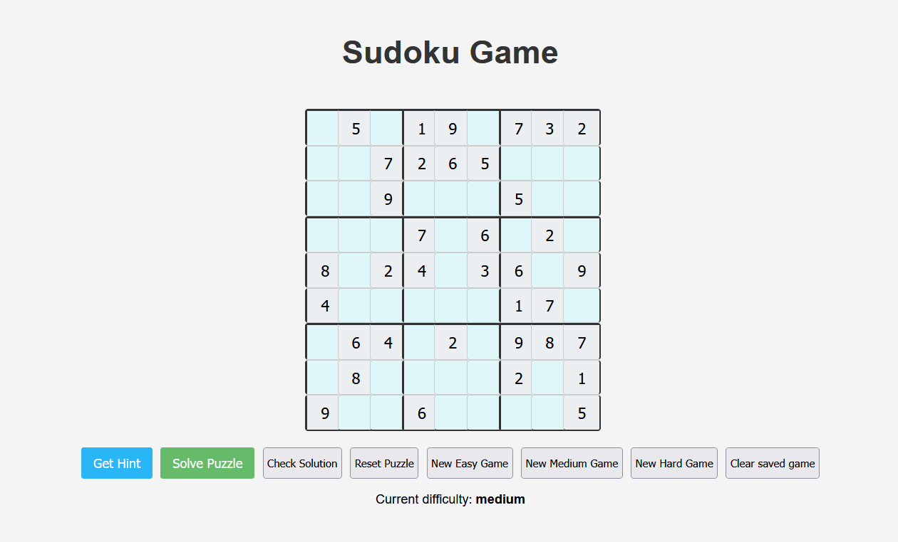
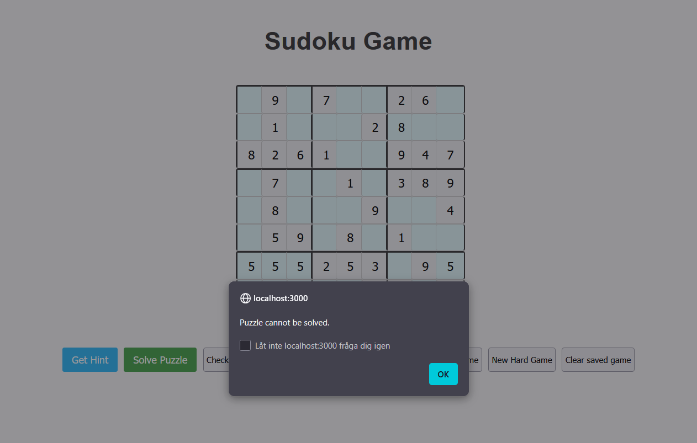
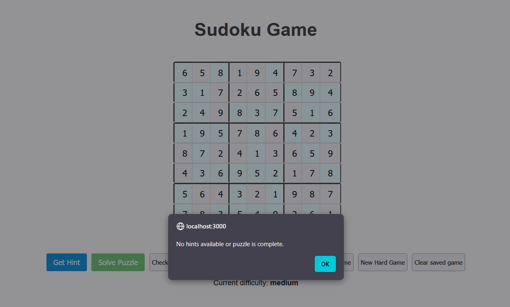
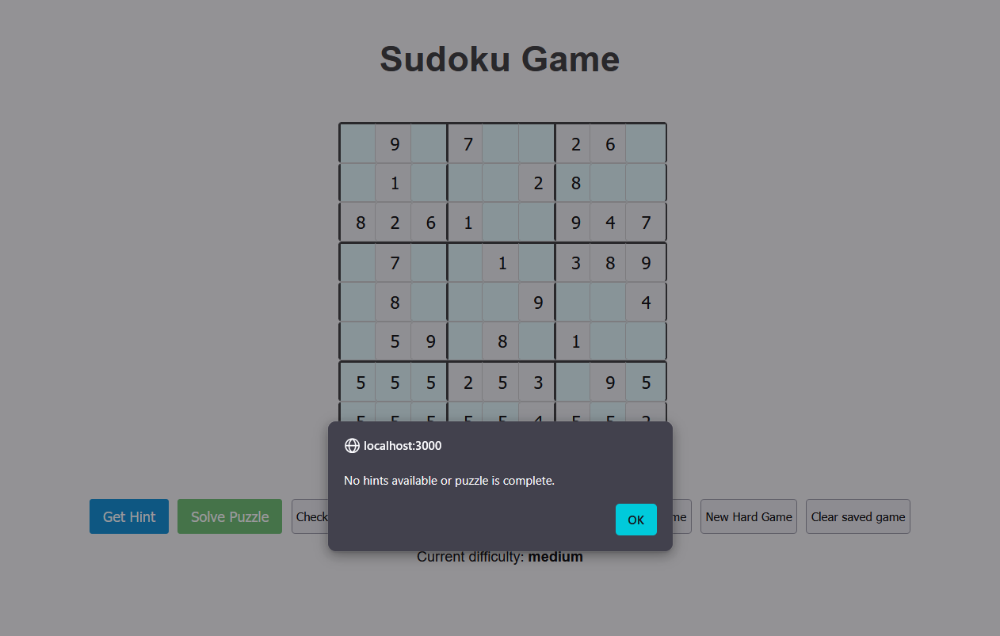
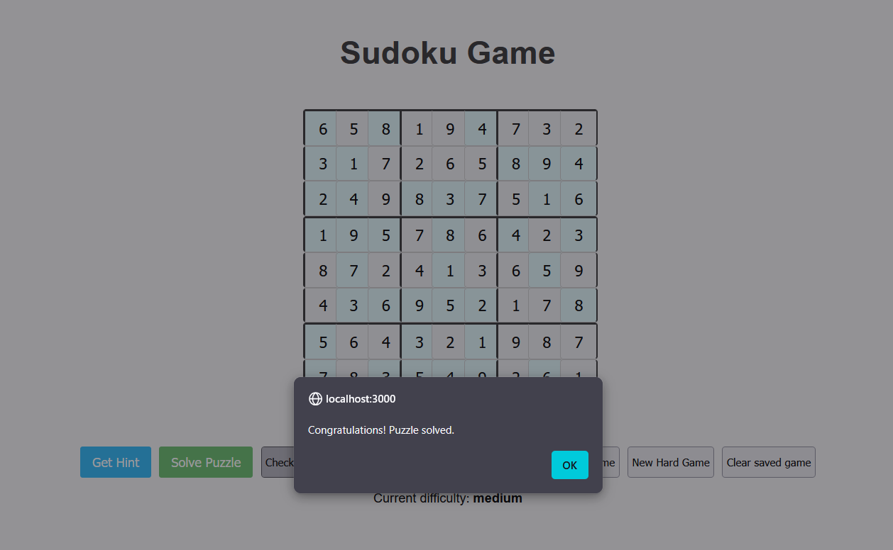
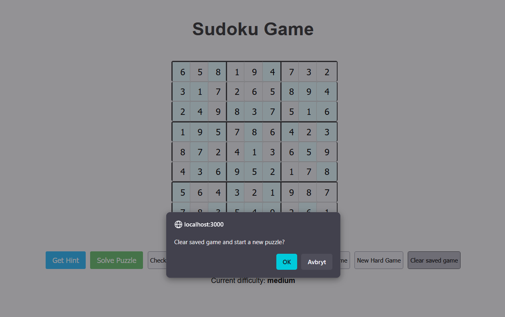

# Test Plan and Test Specification

## Test Strategy

The app will be tested both manually and automatically:

- **Manual Testing**: Covers all functional requirements (FR1–FR7). The user interface will be tested by performing specific tasks, e.g., starting a new puzzle, using solver functions, and providing hints.
- **Automated Testing**: Smoke tests to verify that the app renders and that core controls are present, as well as that they also guard against regressions in bootstrapping (React + routing + Netlify deploy).
- **Negative Testing**: Error handling is tested by inputting invalid values or performing illogical actions on the puzzle grid.

> The assignment allows manual testing (“at least one test per requirement”). We keep the specification explicit and reproducible, and complement it with a small automated suite.

## Test Specification (manual tests)

| ID  | Requirement | Input / Action | Expected Result |
|-----|-------------|----------------|-----------------|
| TC1 | FR1         | Click **New Easy/Medium/Hard Game** | A new grid matching the difficulty is rendered. |
| TC2 | FR2         | Type 1–9 in an editable cell | The digit appears; non‑editable cells remain read‑only. |
| TC3 | FR3         | Click **Get Hint** with at least one empty editable cell | Exactly one cell is filled with a valid candidate; if no hint exists, an informative message is shown. |
| TC4 | FR4         | Click **Solve Puzzle** | The entire grid becomes solved. |
| TC5 | FR5         | Click **Check Solution** for a complete, correct grid | Shows a success message. For incomplete/invalid grids shows a failure message. |
| TC6 | FR6         | Fill a few cells; refresh the page | The same grid and progress are restored (localStorage). |
| TC7 | FR7         | Click **Clear saved game**, confirm dialog | Saved state is cleared and a fresh `medium` puzzle is generated **without page reload**. |
| TC8 | NFR2        | Use arrow keys and Tab/Shift+Tab | Focus moves between cells as expected; no stray typing in read‑only cells. |
| TC9 | NFR5        | Inspect with a screen reader / dev tools | Cells have appropriate `aria-label`s; interactive controls are keyboard accessible. |
| TC10| NFR1        | Typical laptop/phone | Typing/moving focus feels instant; no lag on hint/solve/check. |

## Test Report

- **Date**: [2025-10-22]
- **Version**: 2.0.0
- **Test Environment**: Firefox + Chrome on Windows 11

### Automated Tests (Smoke)

- [`src/App.test.js`](./sudoku-app/src/App.test.js) verifies the app renders the title and “Solve Puzzle” button.  
- The test suite uses **Jest** + **Testing Library** and **mocks** the L2 module’s sub‑imports to avoid ESM transforms in `node_modules`.

### Test Results

| Case | Result | Notes |
|------|--------|-------|
| TC1–TC5 | PASS | Difficulty variations produce valid puzzles; solve/check works as expected. |
| TC6 | PASS | Filling cells and reloading restores the state from localStorage. |
| TC7 | PASS | “Clear saved game” now starts a fresh `medium` puzzle **without** page reload (confirmation dialog appears). |
| TC8 | PASS | Arrow keys and Tab/Shift+Tab move focus correctly. |
| TC9 | PASS | Inputs have `aria-label`; no blockers found. |
| TC10| PASS | Interactions are instant; no crashes observed. |

### Evidence (Screenshots)

## Conclusion

The SudokuSolver application passes all the specified test cases, indicating that it functions correctly and provides a good user experience. The app is stable, user-friendly, and meets the requirements for a Sudoku puzzle game. Users can:

* Generate new puzzles with varying difficulty levels.
* Interact with the puzzle grid effectively.
* Receive hints and solve puzzles.
* Reset puzzles and check solutions.
